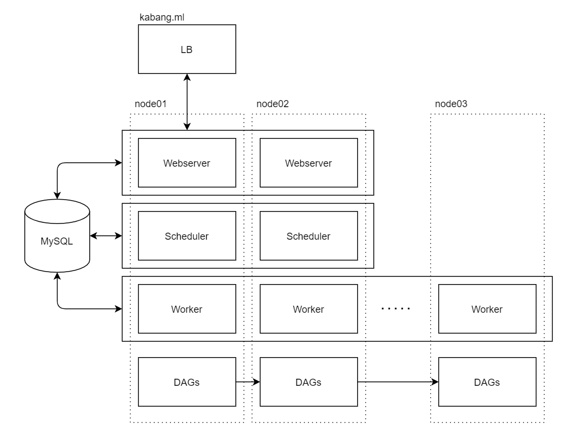

# README.md

## 소개

> https://airflow.apache.org/docs/apache-airflow/stable/concepts/smart-sensors.html

`smart sensor` 가 해결하고자 하는 것

1. sensor 대기로 인해 pool 을 차지하고 있는 문제
2. 중복되는 sensing 으로 인한 비효율적 자원 사용

## 간단히 써보기

```bash
# init
sudo rm -rf mnt/mysql/*
docker-compose up airflow-init
docker-compose up -d

# create conn `fs_default`
# turn on `smart_sensor_shard_[0-4]`
# turn on `smartsensor_[0-4]`

# make an upstream job done
docker exec analytics-airflow_airflow-scheduler_1 touch /opt/airflow/edw.0008.job
docker exec analytics-airflow_airflow-webserver_1 touch /opt/airflow/edw.0008.job
docker exec analytics-airflow_airflow-worker_1    touch /opt/airflow/edw.0008.job

# connect to mysql
docker exec -it analytics-airflow_mysql_1 bash
mysql -urollingpin -prollingpin -Drollingpin
```

### 테이블 조회 결과

`sensor_instance`

```sql
select id
     , task_id
     , state
     , hashcode
     , updated_at 
  from sensor_instance
 order by state desc, updated_at desc, id asc
;
```

```sql
mysql> desc sensor_instance
    -> ;
+-------------------+---------------+------+-----+---------+----------------+
| Field             | Type          | Null | Key | Default | Extra          |
+-------------------+---------------+------+-----+---------+----------------+
| id                | int           | NO   | PRI | NULL    | auto_increment |
| task_id           | varchar(250)  | NO   |     | NULL    |                |
| dag_id            | varchar(250)  | NO   | MUL | NULL    |                |
| execution_date    | timestamp(6)  | NO   |     | NULL    |                |
| state             | varchar(20)   | YES  | MUL | NULL    |                |
| try_number        | int           | YES  |     | NULL    |                |
| start_date        | timestamp(6)  | YES  |     | NULL    |                |
| operator          | varchar(1000) | NO   |     | NULL    |                |
| op_classpath      | varchar(1000) | NO   |     | NULL    |                |
| hashcode          | bigint        | NO   | MUL | NULL    |                |
| shardcode         | int           | NO   | MUL | NULL    |                |
| poke_context      | text          | NO   |     | NULL    |                |
| execution_context | text          | YES  |     | NULL    |                |
| created_at        | timestamp(6)  | NO   |     | NULL    |                |
| updated_at        | timestamp(6)  | NO   | MUL | NULL    |                |
+-------------------+---------------+------+-----+---------+----------------+
15 rows in set (0.00 sec)

mysql> select id
    ->      , task_id
    ->      , state
    ->      , hashcode
    ->      , updated_at 
    ->   from sensor_instance
    ->  order by state desc, updated_at desc, id asc
    -> ;
+----+------------+---------+----------------------+----------------------------+
| id | task_id    | state   | hashcode             | updated_at                 |
+----+------------+---------+----------------------+----------------------------+
|  4 | edw_d_0001 | success |  8528562936231012770 | 2021-11-04 12:51:45.759170 |
| 16 | edw_d_0001 | success |  8528562936231012770 | 2021-11-04 12:51:45.759170 |
| 23 | edw_d_0001 | success |  8528562936231012770 | 2021-11-04 12:51:45.759170 |
|  1 | edw_d_0006 | sensing |  -976187265424870262 | 2021-11-04 12:51:45.759163 |
|  2 | edw_d_0009 | sensing |  2379676783474210405 | 2021-11-04 12:51:45.759163 |
|  3 | edw_d_0005 | sensing |  8876449882199701731 | 2021-11-04 12:51:45.759163 |
|  5 | edw_d_0007 | sensing | -3353382037647755171 | 2021-11-04 12:51:45.759163 |
|  6 | edw_d_0008 | sensing |  2221671376095632141 | 2021-11-04 12:51:45.759163 |
|  7 | edw_d_0002 | sensing |  5604035343605064909 | 2021-11-04 12:51:45.759163 |
|  8 | edw_d_0004 | sensing |  6380125827969972770 | 2021-11-04 12:51:45.759163 |
|  9 | edw_d_0003 | sensing |  4888501173708383233 | 2021-11-04 12:51:45.759163 |
| 10 | edw_d_0002 | sensing |  5604035343605064909 | 2021-11-04 12:51:45.759163 |
| 11 | edw_d_0004 | sensing |  6380125827969972770 | 2021-11-04 12:51:45.759163 |
| 12 | edw_d_0007 | sensing | -3353382037647755171 | 2021-11-04 12:51:45.759163 |
| 13 | edw_d_0003 | sensing |  4888501173708383233 | 2021-11-04 12:51:45.759163 |
| 14 | edw_d_0007 | sensing | -3353382037647755171 | 2021-11-04 12:51:45.759163 |
| 15 | edw_d_0002 | sensing |  5604035343605064909 | 2021-11-04 12:51:45.759163 |
| 17 | edw_d_0004 | sensing |  6380125827969972770 | 2021-11-04 12:51:45.759163 |
| 18 | edw_d_0003 | sensing |  4888501173708383233 | 2021-11-04 12:51:45.759163 |
| 19 | edw_d_0008 | sensing |  2221671376095632141 | 2021-11-04 12:51:45.759163 |
| 20 | edw_d_0009 | sensing |  2379676783474210405 | 2021-11-04 12:51:45.759163 |
| 21 | edw_d_0000 | sensing |  3353413311094042303 | 2021-11-04 12:51:45.759163 |
| 22 | edw_d_0002 | sensing |  5604035343605064909 | 2021-11-04 12:51:45.759163 |
+----+------------+---------+----------------------+----------------------------+
23 rows in set (0.00 sec)

mysql> 
```

## 느낀점

* group shard ㄷㄷ.
* 디버깅이 어렵다.
* `early-access` 딱지가 아직도 붙어있다.
* 레퍼런스 자료는 거의 없고 대체품으로 defferal operator & sensor 를 내놨다.
* 활용 의미가 있으려면, 우리 작업이 선행보다 많아지는 시점?

## 대안

* dynamic DAG
* `triggerer`
  * deferrable operators & triggers
    * https://airflow.apache.org/docs/apache-airflow/stable/concepts/deferring.html

### dynamic DAG

하나의 DAG definition file 에서 모든 작업의 DAG 를 그리기때문에 비용이 적음 (한 프로세스, 한번의 DB 연결에서 모든 작업 스케줄 로드)

1. 해당일 전체 작업 실행 여부 및 선행 작업 완료 여부를 DB 질의해서 저장해둠
2. `1.` 에서의 결과를 바탕으로 DAG 그리기
3. 작업 순서 및 SQL 은 별도 yml 파일에서 참조
4. 영업일작업인 경우 작업 이력 테이블을 조회해서 실행되지 않은 날짜부터 n times 실행
5. 작업 종료

## HA

https://docs.celeryproject.org/en/stable/getting-started/backends-and-brokers/index.html#sqlalchemy



redis memcache 를 queue 로 사용하는게 일반적인 것 같은데 구성요소가 너무 많아짐.  
컴팩트하게 구성하려면 sqla queue 를 쓰면 좋을 것 같은데 이슈가 많다고 함.


### 깡통 머신 설정

#### py37

```bash
sudo apt update
sudo apt install software-properties-common
sudo add-apt-repository ppa:deadsnakes/ppa
sudo apt update
sudo apt install python3.7 python3.7-dev python3.7-venv
```

#### mysql

```bash
sudo apt-get update
sudo apt-get install mysql-server
sudo apt-get libmysqlclient-dev
sudo systemctl start mysql
```

#### airflow

```bash
pip install 'apache-airflow==2.2.1' \
 --constraint "https://raw.githubusercontent.com/apache/airflow/constraints-2.2.1/constraints-3.7.txt"
pip install virtualenv redis
```

#### docker

```bash
curl -fsSL https://get.docker.com -o get-docker.sh
sh get-docker.sh
sudo usermod -aG docker ubuntu

apt update -y && apt upgrade -y
sudo apt-get install apt-transport-https ca-certificates curl gnupg-agent software-properties-common
curl -fsSL https://download.docker.com/linux/ubuntu/gpg | sudo apt-key add -
sudo add-apt-repository \
"deb [arch=amd64] https://download.docker.com/linux/ubuntu \
$(lsb_release -cs) \
stable"
sudo apt-get update && sudo apt-get install docker-ce docker-ce-cli containerd.io
docker -v
sudo systemctl enable docker && service docker start
service docker status

sudo curl -L "https://github.com/docker/compose/releases/download/1.29.2/docker-compose-$(uname -s)-$(uname -m)" -o /usr/local/bin/docker-compose
sudo chmod +x /usr/local/bin/docker-compose
sudo ln -s /usr/local/bin/docker-compose /usr/bin/docker-compose
docker-compose -version
```

### DB

#### kombu_*

```sql
mysql> desc kombu_queue;
+-------+--------------+------+-----+---------+----------------+
| Field | Type         | Null | Key | Default | Extra          |
+-------+--------------+------+-----+---------+----------------+
| id    | int          | NO   | PRI | NULL    | auto_increment |
| name  | varchar(200) | YES  | UNI | NULL    |                |
+-------+--------------+------+-----+---------+----------------+
2 rows in set (0.00 sec)

mysql> desc kombu_message;
+-----------+------------+------+-----+---------+----------------+
| Field     | Type       | Null | Key | Default | Extra          |
+-----------+------------+------+-----+---------+----------------+
| id        | int        | NO   | PRI | NULL    | auto_increment |
| visible   | tinyint(1) | YES  | MUL | NULL    |                |
| timestamp | datetime   | YES  | MUL | NULL    |                |
| payload   | text       | NO   |     | NULL    |                |
| version   | smallint   | NO   |     | NULL    |                |
| queue_id  | int        | YES  | MUL | NULL    |                |
+-----------+------------+------+-----+---------+----------------+
6 rows in set (0.00 sec)

mysql> 
```

#### celery_*

```sql
mysql> desc celery_taskmeta;
+-----------+--------------+------+-----+---------+----------------+
| Field     | Type         | Null | Key | Default | Extra          |
+-----------+--------------+------+-----+---------+----------------+
| id        | int          | NO   | PRI | NULL    | auto_increment |
| task_id   | varchar(155) | YES  | UNI | NULL    |                |
| status    | varchar(50)  | YES  |     | NULL    |                |
| result    | blob         | YES  |     | NULL    |                |
| date_done | datetime     | YES  |     | NULL    |                |
| traceback | text         | YES  |     | NULL    |                |
| name      | varchar(155) | YES  |     | NULL    |                |
| args      | blob         | YES  |     | NULL    |                |
| kwargs    | blob         | YES  |     | NULL    |                |
| worker    | varchar(155) | YES  |     | NULL    |                |
| retries   | int          | YES  |     | NULL    |                |
| queue     | varchar(155) | YES  |     | NULL    |                |
+-----------+--------------+------+-----+---------+----------------+
12 rows in set (0.00 sec)

mysql> desc celery_tasksetmeta;
+------------+--------------+------+-----+---------+----------------+
| Field      | Type         | Null | Key | Default | Extra          |
+------------+--------------+------+-----+---------+----------------+
| id         | int          | NO   | PRI | NULL    | auto_increment |
| taskset_id | varchar(155) | YES  | UNI | NULL    |                |
| result     | blob         | YES  |     | NULL    |                |
| date_done  | datetime     | YES  |     | NULL    |                |
+------------+--------------+------+-----+---------+----------------+
4 rows in set (0.00 sec)

mysql> 
```


* worker 노드에서 8793 포트 개방 필요