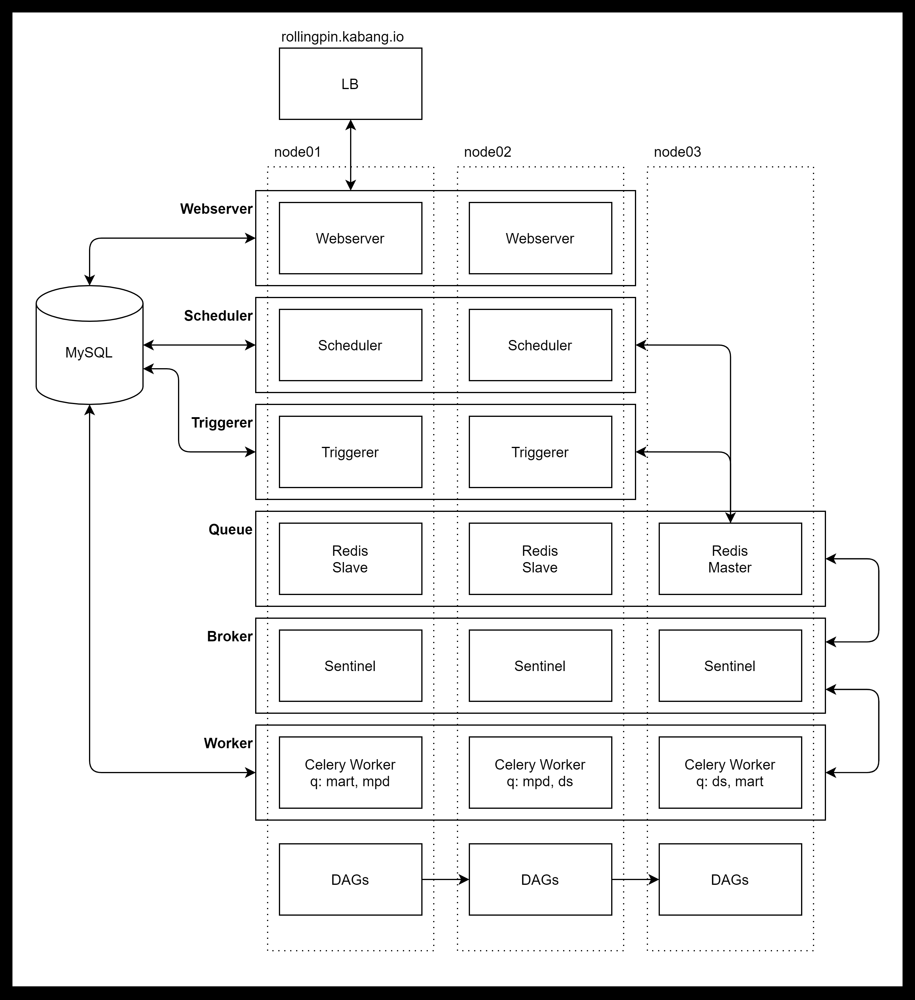

# README.md

## Airflow 2.x HA 구성 multi-node PoC 환경

```bash
# initialize
mkdir -p mnt/dags mnt/logs mnt/plugins
echo -e "AIRFLOW_UID=$(id -u)" > .env

# caution! only for testing
sudo rm -rf mnt/mysql # node1 only
docker-compose up -d
docker exec -it airflow_airflow-worker_1 airflow db init # node1 only
docker exec -it airflow_airflow-worker_1 airflow users create \ # node1 only
--username admin \
--firstname admin  \
--lastname " " \
--role Admin \
--email admin@kabang.ml
sudo chmod -R 777 mnt/mysql # node1 only

# run
docker-compose up -d
```

## Composition



### ec2 설정

#### py37, airflow 개발환경 (Optional)

```bash
# system dev package
sudo apt update
sudo apt install software-properties-common
sudo add-apt-repository ppa:deadsnakes/ppa
sudo apt update
sudo apt install python3.7 python3.7-dev python3.7-venv

# venv
python3.7 -m venv venv
. venv/bin/activate

# airflow
pip install 'apache-airflow==2.2.2' \
 --constraint "https://raw.githubusercontent.com/apache/airflow/constraints-2.2.1/constraints-3.7.txt"
pip install virtualenv redis
```

#### docker 환경 설정

```bash
curl -fsSL https://get.docker.com | sudo sh
sudo usermod -aG docker ubuntu

sudo apt update -y && apt upgrade -y
sudo apt-get install apt-transport-https ca-certificates curl gnupg-agent software-properties-common
curl -fsSL https://download.docker.com/linux/ubuntu/gpg | sudo apt-key add -
sudo add-apt-repository \
"deb [arch=amd64] https://download.docker.com/linux/ubuntu \
$(lsb_release -cs) \
stable"
sudo apt-get update && sudo apt-get install docker-ce docker-ce-cli containerd.io
sudo systemctl enable docker && service docker start

sudo curl -L "https://github.com/docker/compose/releases/download/1.29.2/docker-compose-$(uname -s)-$(uname -m)" -o /usr/local/bin/docker-compose
sudo chmod +x /usr/local/bin/docker-compose
sudo ln -s /usr/local/bin/docker-compose /usr/bin/docker-compose
docker-compose -version
```